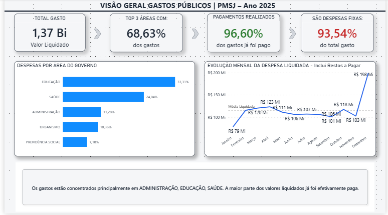
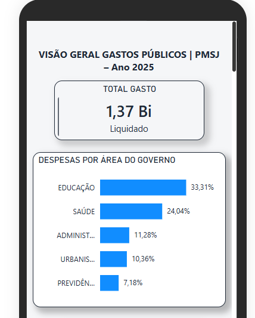

# 📊 Dashboard de Transparência Municipal - Otimização UI/UX & Mobile Wrap

  
  
  
  

### 🔗 [Mobile Friendly Dashboard](https://github.com/ClauSalomoni/mobile-friendly-dash)

---

## 📝 Sobre o Projeto

Este projeto consiste no desenvolvimento e refatoração de um **Dashboard de Transparência Municipal**, focado na análise de receitas e despesas públicas. O principal objetivo foi transformar dados brutos e complexos em uma narrativa visual intuitiva, permitindo que qualquer cidadão ou gestor identifique gargalos e insights financeiros em menos de 5 segundos.

O grande diferencial deste repositório não é apenas a modelagem dos dados, mas a **solução de engenharia frontend** aplicada para garantir a acessibilidade e a responsividade em dispositivos móveis.

---

## 🚀 O Desafio Técnico: UI/UX e Limitações do Power BI

Durante o deploy da primeira versão, identifiquei duas dores crônicas comuns em projetos de Business Intelligence:
1. **Carga Cognitiva Alta (V1):** O excesso de informações e gráficos horizontais extensos prejudicava a intuição do painel no Desktop.
2. **Falta de Responsividade Nativa:** Os links de compartilhamento público do Power BI (`Publish to Web`) ignoram o comportamento dos navegadores mobile, forçando a renderização do layout desktop espremido em telas de celulares, quebrando a experiência do usuário.

### 🛠️ A Solução de Arquitetura

Para resolver o problema sem onerar o projeto com licenças corporativas caras (como o *Power BI Embedded*), utilizei meus conhecimentos em **Desenvolvimento de Sistemas** para criar uma camada de hospedagem customizada:

* **Refatoração de Granularidade:** No layout focado em mobile, apliquei técnicas de *Top N* para resumir os gráficos de barras extensos, mantendo apenas os insights mais críticos visíveis na tela vertical.
* **Wrapper HTML5/CSS3:** Desenvolvi um contêiner web responsivo que captura a *viewport* do dispositivo móvel através de *Media Queries*.
* **Injeção de Parâmetros de Renderização:** O código força o servidor do Power BI a entender a limitação física da tela e injetar o empilhamento vertical correto utilizando a propriedade `pageView=oneColumn` combinada com o ajuste dinâmico do `iframe`.

---

## 📈 Evolução do Design (Antes vs. Depois)

### Layout Desktop Refatorado (Foco em Narrativa)
<kbd>
  
</kbd>

### Layout Mobile Nativo Forçado via Web Wrapper - expectativa

  <kbd>
    
</kbd>

---

## 🛠️ Tecnologias e Conceitos Aplicados

* **Business Intelligence & Dados:** Power BI Desktop, DAX, Modelagem Star Schema, Filtros Avançados (Top N).
* **UI/UX:** Redução de carga cognitiva, hierarquia visual de KPIs, acessibilidade móvel (*mobile-first thinking*).
* **Frontend & Deploy:** HTML5, CSS3 (Media Queries), Git, GitHub Pages para hospedagem estática gratuita e performática.

---
